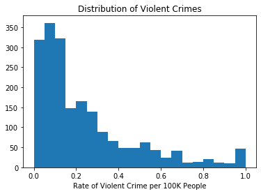
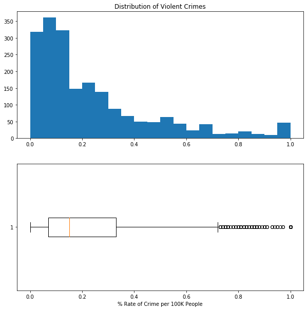
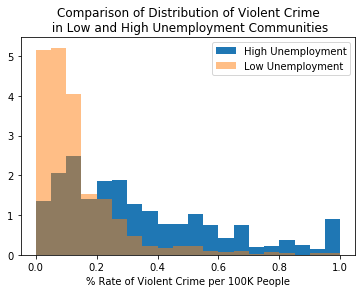
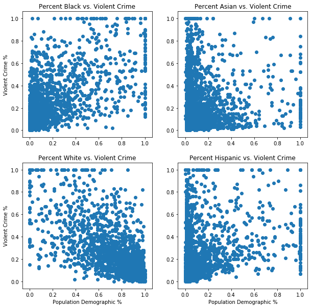

For this morning's warmup, you will look at data related to the rate of violent crime in communities across the U.S. You will practice plotting data extracted from a Pandas dataframe.

The data comes from the UCI [Machine Learning Repository](https://archive.ics.uci.edu/ml/datasets/communities+and+crime), a data resource which you should become familiar.

You can read about the data in the communities.names file in the data folder.


```python
import pandas as pd
import numpy as np
import matplotlib.pyplot as plt
pd.set_option('display.max_columns', None)
```


```python
with open('data/communities.names', 'rb') as read_file:
    data = read_file.readlines()
```


```python
headers = [attr.decode('UTF-8').strip() for attr in data[75:203]]
headers = ['_'.join(attr.split(' ')[1:]) for attr in headers]
```


```python
df = pd.read_csv('data/communities.data', header=None)
df.columns = headers
```

Call the `.head()` method off the end of the `df` variable to start inspecting the data.


```python
# Your code here
```

For a list of column names, us `df.columns`. Use `list(df.columns)` to output all feature names.


```python
# Your code here
```

Matplotlib expects you to pass array-like objects as arguments to its plotting methods.  So, to do so, we have to isolate columns of the dataframe using square brackets and column names:

`df['column_name']`

or, if there are no spaces in the name, dot syntax:

`df.column_name`

Isolate the `ViolentCrimesPerPop_numeric` column and place it into the variable below.


```python
violent_crime = None
```


```python
#__SOLUTION__
violent_crime = df['ViolentCrimesPerPop_numeric']

```

# Task 1

Plot a histogram of the violent crime variable. Use plt.suplots(), and don't forget labels.


```python
# Your code here
```


```python
#__SOLUTION__
fig, ax = plt.subplots()
ax.hist(violent_crime, bins=20)
ax.set_title('Distribution of Violent Crimes')
ax.set_xlabel('Rate of Violent Crime per 100K People');
```





Next, create a figure with two plots, one above the other.  

The top is the histogram from above, and the bottom is a boxplot of the same data.
Rotate the boxplot so that it is horizontally oriented.


```python
# Your code here
```


```python
#__SOLUTION__
fig, ax = plt.subplots(2,1, figsize=(10,10))

ax[0].hist(violent_crime, bins=20)
ax[0].set_title('Distribution of Violent Crimes')
ax[1].boxplot(violent_crime, vert=False)
ax[1].set_xlabel('% Rate of Crime per 100K People');
```





Finally, compare the distributions of violent crime across communities with high and low unemployment.

To do so, we will split the data up into two: communities with pct unemployment above the median value, and those below.

In pandas, we do so by subsetting the data frame.  `df[df['column'] > some_value]`


```python
# your code here
df_high_unmply = None
df_low_unmply = None
```


```python
#__SOLUTION__
df_high_unmply = df[df['PctUnemployed_numeric'] > df['PctUnemployed_numeric'].median()]
df_low_unmply = df[df['PctUnemployed_numeric'] < df['PctUnemployed_numeric'].median()]
```

Isolate the violent crime column from each of these new dataframes.


```python
# Your code here
high_unmply_vc = None
low_unmply_vc = None
```


```python
#__SOLUTION__
high_unmply_vc = df_high_unmply['ViolentCrimesPerPop_numeric']
low_unmply_vc = df_low_unmply['ViolentCrimesPerPop_numeric']
```

Now, plot two histograms on the same axis, one on top of the other.  Set the opacity (alpha) of the second histogram to .5. Don't forget to include a legend.


```python
# Your code here
```


```python
#__SOLUTION__
fix, ax = plt.subplots()

ax.hist(high_unmply_vc, density=True, label='High Unemployment', bins=20)
ax.hist(low_unmply_vc, alpha=.5, density=True, label='Low Unemployment', bins=20)
ax.set_title('Comparison of Distribution of Violent Crime\n in Low and High Unemployment Communities')
ax.set_xlabel('% Rate of Violent Crime per 100K People')
plt.legend();
```





# Task 2

Create a figure with multiple scatter plots.  Choose several related features (columns) to use as the data corresponding to the x-axis.  The y-axis on each will correspond to the `ViolentCrimesPerPop_numeric` columns.

To begin, we need to isolate the Violent Crimes feature again. Assign it to the variable `y` below


```python
# Your code here
y = None
```


```python
#__SOLUTION__
# Assign violent crime to the y_axis variable
y = df['ViolentCrimesPerPop_numeric']
```

Now, choose up to 4 numeric features for the x-axis on scatterplots within 1 figure.  


```python
x1 = None
x2 = None
x3 = None
x4 = None
```


```python
#__SOLUTION__

x1 = df['racepctblack_numeric']
x2 = df['racePctAsian_numeric']
x3 = df['racePctWhite_numeric']
x4 = df['racePctHisp_numeric']
```

Using fig, ax syntax, plot 4 scatterplots in 1 figure.  Make sure to add titles to each, as well as label the axes. Use a 2x2 grid.


```python
# Your code here
```


```python
#__SOLUTION__

fig, ax = plt.subplots(2,2, figsize=(10,10))

ax[0][0].scatter(x1, y)
ax[0][0].set_title('Percent Black vs. Violent Crime')
ax[0][0].set_ylabel('Violent Crime %')

ax[0][1].scatter(x2, y)
ax[0][1].set_title('Percent Asian vs. Violent Crime')

ax[1][0].scatter(x3, y)
ax[1][0].set_title('Percent White vs. Violent Crime')
ax[1][0].set_xlabel('Population Demographic %')
ax[1][0].set_ylabel('Violent Crime %')

ax[1][1].scatter(x4, y)
ax[1][1].set_title('Percent Hispanic vs. Violent Crime')
ax[1][1].set_xlabel('Population Demographic %')
```


    Text(0.5, 0, 'Population Demographic %')




